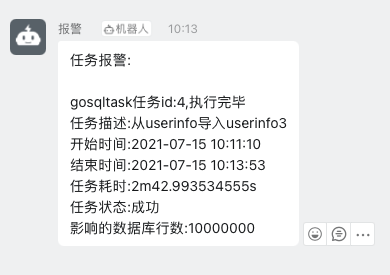

## 一.gosqltask
> 开发这个工具的初衷是作者实际工作当中需要经常性的写一些sql脚本去取数据或者生成中间表再去加工数据,充斥着重复的逻辑开发。因此将重复开发的部分抽象了reader和writer做成了可配置化的工具

- 1.1 gosqltask使用go执行sql任务,当执行的sql读取的是超千万数据量级别的大表时,可通过配置表的切分条件,一般是主键自增id或者业务id(整数)索引进行切分,按batch切分读取数据,利用go的通道和协程特性去快速执行读取写入任务。

- 1.2 gosqltask适用于数据开发和数据分析人员以及经常写sql的同学,暂时支持的读写客户端限于mysql(由于spark官方还未支持go,经常写hivesql/sparksql的可以用python/scala语言实现) [python-可配置化的数据同步及大数据计算方案](https://mp.weixin.qq.com/s/nARKlyPNtqrtxC2EN3iZCw) 

- 1.3 常规开发模式,写脚本的方式可能是这样,下面以python 单线程执行读写 作为案例

```python
QUERY  = "select a,b,c from db.table"

INSERT = "insert into *.*(a,b,c)values(?,?,?)"

class Scheduler(object):
      def __init__(self,config):
      	   self.config = config
      	   self.db = mysqlclient.from_settings(self.config)

      def read(self):
          datas = self.db.execute(QUERY)
          return datas

      def write(self,datas):
      	  batch = 1000
      	  values = []
      	  while datas:
              data = datas.pop()
              values.append(data)
              if len(values) == batch:
                 self.db.write(INSERT,values)
                 values.clear()
      	  if values:
              self.db.write(INSERT,values)
              values.clear()

      def process(self):
          datas = self.read()
          self.write(datas)
          self.db.close()

if __name__ == "__main__":
     config = {
       "host":"xx",
       "user":"xxx"
     }
     obj = Scheduler(config)
     obj.process()
```

当再来需求的时候,怎么办呢？将QUERY变量和INSERT变量的值换一下,重新建一个py脚本.
从上面的过程可以看出,每次变化的是读取的规则和写入的规则,处理流程也无非是这样:读到数据->处理数据->写入数据.
有没有什么办法可以只关注业务逻辑的开发而减少代码量的编写？基于这个想法,学习go也半年多了,加深下对go的使用,开发这个工具

### 二.需要解决的问题

- 2.1 配置文件 如何可拓展？
```
采用json配置文件,config 目录有2个json文件 这俩文件必须放在同一个目录,不一定放在本项目config目录
1.dev.json 主要是任务表的配置和报警的信息配置,后面会加上log的配置
2.db_global.json是一个全局数据库连接的配置,任务表里面$from_app_$from_db作为reader的key,$to_app_$to_db作为reader的key
这样后面新增了from_app/from_db的时候 修改一下此文件即可纵向拓展,所有的host连接应尽可能使用内网
```

- 2.2 如何定义一个sql任务,如何管理sql任务？

``` go
type TaskInfo  struct {
	Id             string `json:"id"`              // 统计任务id
	FromApp        string `json:"from_app"`        // 读取的业务系统
	FromDbType     string `json:"from_db_type"`    // 读取的数据源类型mysql/oracle等
	FromDb         string `json:"from_db"`         // 读取的数据库
	StaticRule     string `json:"static_rule"`     // 统计规则
	Params         string `json:"params"`          // 增量规则
	ToApp          string `json:"to_app"`          // 写入的业务系统
	ToDbType       string `json:"to_db_type"`      // 写入数据源类型
	ToDb           string `json:"to_db"`           // 写入数据库
	ToTable        string `json:"to_table"`        // 写入数据表
	OnlineStatus   string `json:"online_status"`   // 统计状态0统计1不统计
	WriteMode      string `json:"write_mode"`      // 写入模式replace/insert/update/delete/append/overwrite
	TaskDesc       string `json:"task_desc"`       // 统计描述
	IsTruncate     string `json:"is_truncate"`     // 是否truncate表(0-truncate)
	Owner          string `json:"owner"`           // 取数人
	TaskStatus     string `json:"task_status"`     // 任务状态
}

这里使用mysql表来存储任务,后面对这个表可以写api,实现任务的创建/提交执行/导出数据
表结构及案例见data/data.sql,这几个表创建在test数据库以后,dev.json里面taskmeta.conn需要修改为data.sql导入的表所在的test数据库信息。
gosqltask虽然暂时只支持mysql2mysql的sql任务,这个表2个字段FromDbType和ToDbType 
后面可以使用其他语言进行拓展,作者之前经常写spark任务,使用pyspark读取任务表配置的工具
```

- 2.3 demo数据

```
demo的任务,依赖的test.orders/test.userinfo表,2.2步骤已经将data.sql导入test数据库。
可以自己写脚本mock一些大批量的数据测试一下.
userinfo我本地mock了1000万数据。
```


- 2.4 大表查询慢问题
```
gosqltask暂时支持按自增主键(整数型)进行切分,如果是非自增id列,需修改scheduler.GetStartEnds方法.
此方法目前是针对我司id不连续避免空循环浪费特定,后面有待优化。
按主键切分应该可以满足大部分数仓处理任务。

params字段设置分割条件 json格式
{
  "split":{
    "table":"test.userinfo", //分割的表
    "pk":"id",               //根据哪个字段分割 测试最好按主键
    "worker_num":20,         //多少个worker执行
    "read_batch":10000,        //根据$pk的值多少一个区间读取 拼接 where条件 $pk>0 and $pk<=$read_batch
    "write_batch":300        //批量写入的值
  }
}

params字段设置完毕,static_rule 统计规则设置 举例:
test.userinfo表如果有6000万数据,想对每个id的区间有多少数据做一个统计,我们可能会这样写sql

select 
   case 
     when id>0 and id<=10000 then "(0,10000]"
     when id>10000 and id<=20000 then "(10000,20000]"
     ... else "[600000000,600010000]" end as section,count(1) as users
from test.userinfo
group by 
  case 
     when id>0 and id<=10000 then "(0,10000]"
     when id>10000 and id<=20000 then "(10000,20000]"
     ... else "[600000000,600010000]" end

实际执行上面这个sql的时候 由于数据量过大会很慢,这张表1000万数据运行了近20s
当按如下规则配置时由于命中了索引,执行会很快 
select $start as start,$end as end,users
from (
	  select count(1) as users
	  from $table 
    where $pk>$start and $pk<=$end 
) as a
 
我们约定 $start 代表切分键的起始值, $end 代表切分键的结束值,当params.split.read_batch=20000时,上面的执行sql被分成这样的计划执行,根据id主键按20000一个区间进行分批次读取
select 0 as start,20000 as end,num
from (
	select count(1) as num
	from test.userinfo
  where id>0 and id<=20000
) as a
...
...
select 20000 as start,40000 as end,num
from (
	select count(1) as num
	from test.userinfo
  where id>20000 and id<=40000
) as a

最终结果是运行了4s,性能提升近5倍

```
- 2.5 增量条件如何传递(格式暂定为yyyy-mm-dd,后面json会加一个$formater参数 支持更多的时间格式)
```
很多时候我们需要跑一些增量统计,对增量表添加时间限制是最常用的办法,举例 每天增量的订单量/订单额

select order_date,count(order_id) as orders,sum(order_amount) as order_amount
from test.orders
where order_time >= "2021-07-13" and order_time < "2021-07-14"
group by order_date

我们可以将order_date>="2021-07-13" 这个条件 根据业务场景 配置到params
params字段 json格式 我们约定"$today"是获取北京时间的一个特殊变量,$today为今天,$today-n 就是今天往前推n天 $today+n就是今天往后推n天 参数example:
{
  "time_increase":{
      "$1":"$today-1",
      "$2":"$today"
}
}

params字段设置完毕,static_rule 统计规则设置为:

select substr(order_time,1,10) as order_date,count(order_id) as orders,sum(order_amount) as order_amount
from test.orders
where order_time>="$1" and order_time < "$2"
group by substr(order_time,1,10)

程序会自动匹配$1 和$2的值去执行

具体处理的函数为:util.go.GetDateFromToday

import (
	"time"
)

var DayFormatter = "2006-01-02"

func GetDateFromToday(interval int) string {
	return time.Now().AddDate(0, 0, interval).Format(DayFormatter)
}

============================================================================
func (sd *Scheduler)getTimeValue(v string) string{
	if strings.TrimSpace(v) == "$today"{
		return GetDateFromToday(0)
	}else if strings.Contains(v,"$today-"){
		num := strings.TrimSpace(strings.Replace(v,"$today-","",-1))
		n,err := strconv.Atoi(num)
		if err != nil{
			log.Fatal(err)
		}
		return GetDateFromToday(-n)
	}else{
		num := strings.TrimSpace(strings.Replace(v,"$today+","",-1))
		n,err := strconv.Atoi(num)
		if err != nil{
			log.Fatal(err)
		}
		return GetDateFromToday(n)
	}
}
```

- 2.6 表到表的同步 taskid=4 test.userinfo 导入到 test.userinfo3(datas.sql会建好和userinfo一样的表结构)
```
统计规则设置为 select * from $table where $pk>$start and $pk <= $end


任务报警:
gosqltask任务id:4,执行完毕
任务描述:从userinfo导入userinfo3
开始时间:2021-07-15 10:11:10
结束时间:2021-07-15 10:13:53
任务耗时:2m42.993534555s
任务状态:成功
影响的数据库行数:10000000
```

- 2.7 任务执行状态？通知?
```
1.机器人报警支持了钉钉和企业微信,在dev.json配置roboter.token参数
2.任务表配置了开发者的手机号,这样即使某个人离职或者变更了开发组,可批量更新开发者手机号无需更改代码。
3.考虑有的人不希望将手机号暴露在数据库,dev.json配置roboter配置里面@的手机号可填写一个默认值放在服务器,但我认为没啥必要,毕竟也就只有使用这个表的人可以看到
```

- 2.8 自动建表功能

```
1.实际开发我们可能需要先创建表结构,然后再编写代码,gosqltask考虑到了这些经常做的问题.
2.针对select语句可以自动获取schema,会默认在$to_db数据库创建$to_table表(如果已经建好表也不会报错)
3.自动建的表数据类型默认都是varchar(255),并且添加了默认主键和入库时间/更新时间字段
如果写入的字段很多,可以先让程序建表,开发者对自动创建的表结构修改一下数据类型即可
```

- 2.9 程序支持的命令行参数
```
-c 配置文件目录 
-e 配置文件名称
-d debug debug=true时候 默认打印执行的sql(如果是任务池提交,默认打印$start=0 && $end=10000区间的sql,
    便于查看sql语句是否正确
  )
-id sql_tasks.任务id

例子:
a.默认读取./config/dev.json 调试运行任务id=3
go run gosqltask.go --debug=true -id 3

b.默认读取./config/dev.json 运行任务id=3
go run gosqltask.go --debug=false -id 3

c.默认读取具体路径的test配置文件 运行任务id=3
go run gosqltask.go -c 配置文件路径 -e test --debug=false -id 3
```


## 三.运行日志

```
➜  gosqltask git:(master) ✗ go run gosqltask.go -e test --debug=false -id 3
2021/07/15 11:14:33 ConfigPath: ./config/ ,Env: test ,TaskId: 3 Debug:false
2021/07/15 11:14:33 QueryTaskSql is  select * from sql_tasks where id=? and online_status=0
2021/07/15 11:14:33 ok! query taskmeta mysql client closed
2021/07/15 11:14:33 taskInfo.Params is
 {"split":{"table":"test.userinfo","pk":"id","worker_num":20,"read_batch":20000,"write_batch":300}}
2021/07/15 11:14:33 clean static_rule :select $start as start,$end as end,num
from (
	select count(1) as num
	from $table
        where $pk>$start and $pk<=$end
) as a
2021/07/15 11:14:33 truncate table test.temp_static_by_pool success
2021/07/15 11:14:33 start,end  0 10000000
2021/07/15 11:14:33 producer job params  &{0 20000}
2021/07/15 11:14:33 producer job params  &{20000 40000}
2021/07/15 11:14:33 producer job params  &{40000 60000}
...
2021/07/15 11:14:37 producer job params  &{9960000 9980000}
2021/07/15 11:14:37 &{3 13 9700000 9720000 1 0}
2021/07/15 11:14:37 producer job params  &{9980000 10000000}
2021/07/15 11:14:37 producer job params finished
2021/07/15 11:14:37 &{3 4 9680000 9700000 1 0}
...
2021/07/15 11:14:37 &{3 18 9980000 10000000 1 0}
2021/07/15 11:14:37 &{3 9 9960000 9980000 1 0}
2021/07/15 11:14:37
gosqltask任务id:3,执行完毕
任务描述:大表切分demo
开始时间:2021-07-15 11:14:33
结束时间:2021-07-15 11:14:37
任务耗时:4.543000249s
任务状态:成功
影响的数据库行数:500
2021/07/15 11:14:37 close reader and writer if writer is not null
```

任务3统计的结果已经自动写到了test.temp_static_by_pool表


## 四.注意事项

### 一定要慎重!一定要慎重！一定要慎重！
```
任务表有一个字段is_truncate 代表是否先清空写入的表,is_truncate=0 代表先清空,=1代表不清空,所以我默认值设置为了1.
当is_truncate=0时,$to_db.$to_table的值一定要慎重!一定要慎重！一定要慎重！
```
## 五.钉钉通知-报警 




## 六.公众号文章拓展
- 6.1 [数据平台管理后台的设计与实现](https://mp.weixin.qq.com/s/lzqoLZv37bzekEvGpZ8c5w)
- 6.2 [5分钟内使用go对2张8000万表进行对比](https://mp.weixin.qq.com/s/ZNz789KYe3RcjMLvlAECyQ)
- 6.3 [python-可配置化的数据同步及计算方案](https://mp.weixin.qq.com/s/nARKlyPNtqrtxC2EN3iZCw)


## 七.思考的问题
```
在写这个工具之前,实时数据同步采用的是监听上游mysql的binlog到rabbitmq,后面消费消息队列写入到下游mysql的架构。
这里面也是充斥着大量的重复代码的开发,对不同的表而言,仅仅是表的schema不同而已,抓住了问题的本质,设计加实现并没有预想
的那么困难。

如果仅仅复制粘贴,换了几个变量名,从技术能力和开发思维上来看其实是没成长的,怎么快速提升开发效率并且还不会出错更值得深思。
当你1个人可以胜任几个人的开发量,价值会更加突出。

介绍几个模板化思想应用的非常好的框架:
1.python scrapy爬虫框架。去看scrapy项目的源码,从使用角度出发,当运行 scrapy startproject xxx的时候
为什么会生成了一个xxx目录,当运行 scrapy startproject xxx2的时候为什么会生成了一个xxx2目录 并且里面代
码大部分都是一样的,仅仅是类名变了而已。后来从命令行分析代码的执行逻辑,原来scrapy 有一个template目录,里面
就是一堆代码模板,通过你传入的参数不同生产了不同的变量名最后写入到了项目里不同的py文件。开发者只需要关注爬取
逻辑开发,request/pipline/middware已经生成了,settings里面类似插件一样,使用的时候取消注释或者自己继承基
类编写模块就好了。

2.go-zero里面的goctl工具。理念也是类似,让使用者关注业务逻辑的开发,各个端的代码一键生成,这远比复制粘贴写100个
1000个api带来的价值打多了,手写定义model都够浪费时间的,使用工具几秒钟生成一天写的model,并且还不会出错。

从这个思想入手,许多东西都是可以批量化生产的,前端管理后台表格的页面代码等


说一下python模板渲染标准库,使用$变量名当做要替换的地方,使用起来貌似比go的text/template模块方便,python传入一个dict(map)就行了
>>> from string import Template
>>> Template("$a").substitute(**{"a":"xxx"})
输出为'xxx'


datax已经足够优秀,但我想还有改进的空间:
比如:
  1.比如配置文件的自动生成,现在先建一个任务应该还是需要手动配置json文件,gosqltask 采用的是将reader和writer的配置
    放在每个任务的$from_app_$from_db 和 $to_app_$to_db里面,db_global.json可以存放各个数据库的配置,以mysql为例，一个数据库实例里面可能有n个表,公用一个数据库实例的config就可以了,不用每个表都去配置1个源.
    获取reader和writer配置可以是基础的公用方法
    readerKey := fmt.Sprintf("from.mysql.%s_%s",sd.taskInfo.FromApp,sd.taskInfo.FromDb)
    writerKey := fmt.Sprintf("to.mysql.%s_%s",sd.taskInfo.ToApp,sd.taskInfo.ToDb)

  2.如果任务需要对中间的数据做处理如何可配置？比如名称清洗,这种在ETL处理过程当中是很常见的做法,这种datax是不好实现拓展,
    毕竟每个公司的数据规则是不同的,并且这种是到了字段级别的设置,mysql内置的函数支持的话可以配置到sql查询语句里实现。如果需要通过代码清洗的就无法实现
    目前数据实时同步过程当中,针对我司的场景,ETL处理的函数都有一个唯一的编号,比如nameClean函数 编号2001,当在配置文件里name字段绑定了2001的规则代码,程序会调用nameClean函数返回清洗后的值,datax如果能动态引入自定义函数就更加完美了.
   

gosqltask后面的拓展性,如何支持更多的客户端的读写,mongo2mysql/mysql2mongo等等
当传入 -id=1 的时候 查询下from_db_type和to_db_type的值,从模板目录找到$from_db_type2$to_db_type的模板,将任务的信息 表的schema等渲染进去,应该是可以做到的。


如何和调度系统打通,任务是有依赖的,推荐使用Dolphinscheduler开源调度工具,比python的airflow更简单,也符合中国人的操作习惯.

```